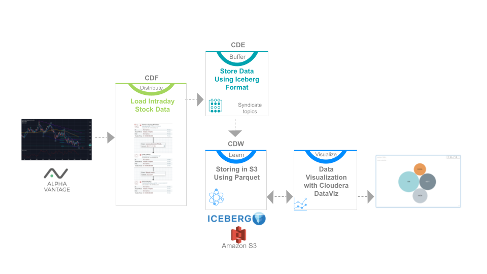

# Partner Summit 2022 - Workshop Student Guide


This document guides students through the Hands on lab for Partner Summit 2022. It will take you step by step to completing the Prerequisites and deliver this demo.

---

## Introduction

The purpose of this repository is to enable the easy and quick setup of the Partner Summit workshop. Cloudera Data Platform (CDP) has been built from the ground up to support hybrid, multi-cloud data management in support of a Data Fabric architecture. This worshop provide an introduction to CDP, with a focus on the data management capabilities that enable the Data Fabric and Data Lakehouse.

## Overview

In this exercise, we will work get stock data from [Alpha Vantage](https://www.alphavantage.co/), offers free stock APIs in JSON and CSV formats for realtime and historical stock market data,

- Data ingestion and streaming—provided by ***Cloudera Data Flow (CDF)*** and
***Cloudera Data Engineering (CDE)**.
- Global data access, data processing and persistence—provided by ***Cloudera Data Hub (CDH)***.
- Data visualization with ***CDP Data Visualization***.

***Cloudera DataFlow (CDF)*** is a scalable, real-time streaming analytics platform that ingests, curates, and analyzes data for key insights and immediate actionable intelligence. CDF’s Flow Management is powered by Apache NiFi, a no-code data ingestion and management solution. Apache NiFi is a very mature open source solution meant for large scale, high velocity enterprise data ingestion use cases.

***Cloudera Data Engineering (CDE)*** is a serverless service for Cloudera Data Platform that allows you to submit batch jobs to auto-scaling virtual clusters. CDE enables you to spend more time on your applications, and less time on infrastructure. CDE allows you to create, manage, and schedule Apache Spark jobs without the overhead of creating and maintaining Spark clusters. With Cloudera Data Engineering, you define virtual clusters with a range of CPU and memory resources, and the cluster scales up and down as needed to run your Spark workloads, helping to control your cloud costs.

***CDP Data Visualization*** enables data engineers, business analysts, and data scientists to quickly and easily explore data, collaborate, and share insights across the data lifecycle—from data ingest to data insights and beyond. Delivered natively as part of Cloudera Data Platform (CDP), Data Visualization delivers a consistent and easy to use data visualization experience with intuitive and accessible drag-and-drop dashboards and custom application creation.



## Pre-requisites

1. Laptop with a supported OS (Windows 7 not supported) or Macbook.
2. A modern browser - Google Chrome (IE, Firefox, Safari not supported).

* Get IP from the ‘web’ instance and go to the web portal
* Login with the username/password as defined per setup
* Download ssh key from web portal and update permission

## Step 1: Get Alpha Vantage Key


## Step 2: Create the flow to ingest stock data via API to Object Storage

setWorkloadPasswordStep1


## Step 3: Create the flow to ingest stock data via API to Object Storage


### Create a new CDF Catalog


[Stocks_Intraday_Alpha_Template.json](Stocks_Intraday_Alpha_Template.json)


### Deploy DataFlow


###  View Nifi DataFlow


### Create Iceberg Table

```sql

CREATE DATABASE stocks;

CREATE TABLE IF NOT EXISTS stocks.stock_intraday_1min (
  interv STRING,
  output_size STRING,
  time_zone STRING,
  open DECIMAL(8,4),
  high DECIMAL(8,4),
  low DECIMAL(8,4),
  close DECIMAL(8,4),
  volume BIGINT)
PARTITIONED BY (
  ticker STRING,
  last_refreshed string,
  refreshed_at string)
STORED AS iceberg;

```

## Step 4: Process and Ingest Iceberg using CDE

## Step 5: Query Iceberg Tables in Hue and Cloudera Data Visualization
